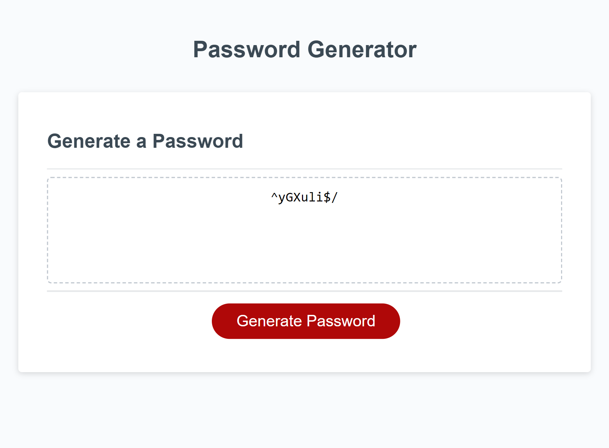

# Password Generator

-Name: Joseph Cotterell
-Email: josephcotterell@hotmail.co.uk

# Description

-I have added a list of characters for my password which includes uppcase, lowercase, numbers and special characters.

-Added generate password function.

-I have added promts to give the user a choice of different characters.

-Arrays have been added for the prompts.

-Comments were included

-I used JavaScript in Visual Studio Code to make this project.

-I pushed this project using GitBash.

## Screenshots

## 

## Link to GitHub repository

[You can find my repository here](https://github.com/josephcotterell/password-generator)

## Link to deployed application

[Access this app on the deployed link here](https://josephcotterell.github.io/password-generator/)
